---
## Features

- CRUD Account
- CRUD Gallery
- Upload Thumbnail
- Static File Serving (/uploads)
- Error Handling

---

## Base URL

```
http://localhost:8080
```

---

# Project Structure

```
├──Repo-Back-end
    ├── cmd 
        ├── server
            ├── uploads
                ├── thumbnail.jpg
            ├── main.go
    ├── internal
        ├── database
            ├── database.go
        ├── handlers
            ├── admin.go
            ├── blog.go
            ├── gallery.go
        ├── models
            ├── admin.go
            ├── blog.go
            ├── gallery.go
        ├── routes
            ├── routes.go
    
```

---

# Account Endpoints

## Get All Admin/Accounts
```
GET http://localhost:8080/admins/

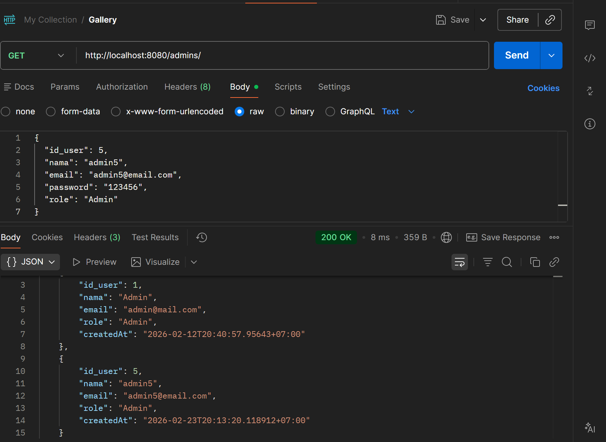
```

## Get Account by ID
```
GET http://localhost:8080/admins/(id)
```
_EXAMPLE_
```
GET http://localhost:8080/admins/1
```
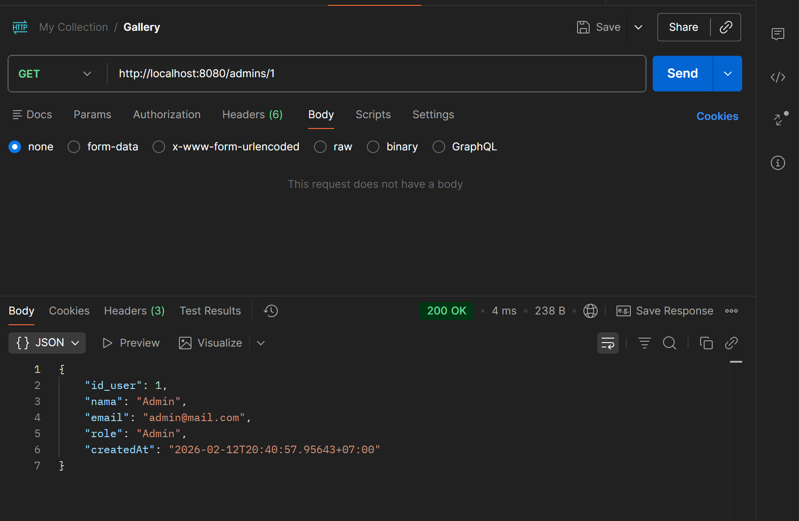

## Create Admin/Account
```
POST http://localhost:8080/admins/
```
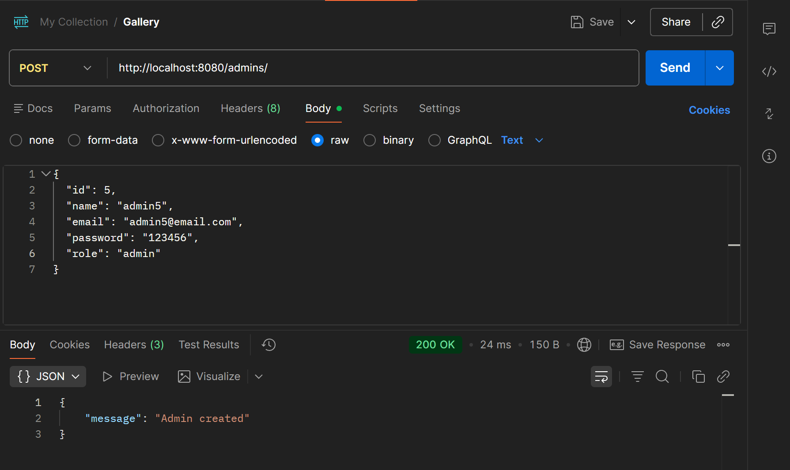

## Update Admin/Account
```
PUT http://localhost:8080/admins/(id)
```
_EXAMPLE_
```
PUT http://localhost:8080/admins/5
```
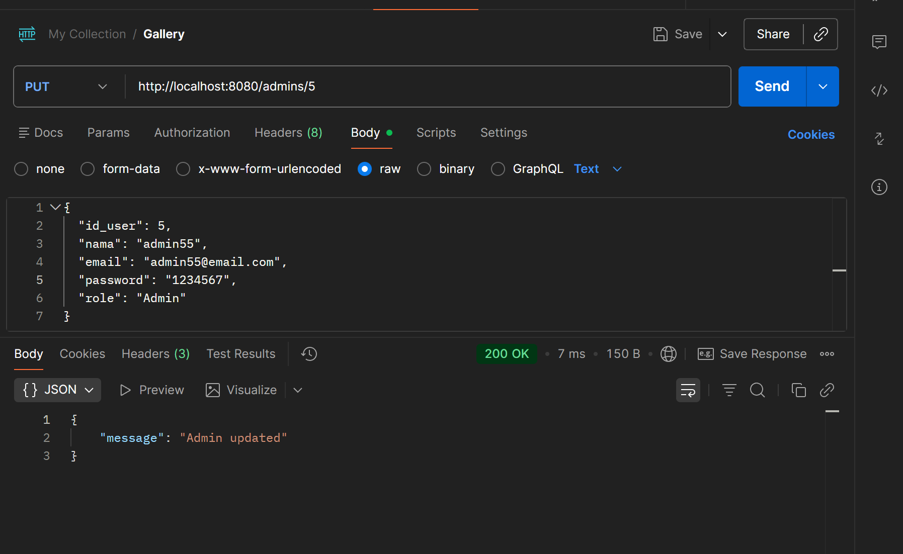

_CEK UPDATE_
```
GET http://localhost:8080/admins/5
```
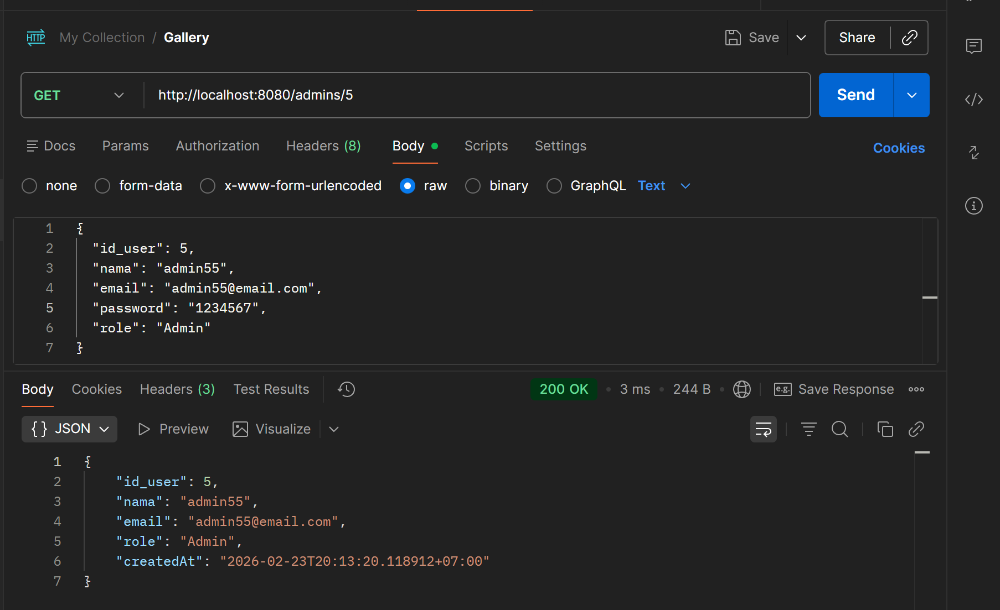

## Delete Admin/Account
```
DELETE http://localhost:8080/admins/(id)
```
_EXAMPLE_
```
DELETE http://localhost:8080/admins/5
```
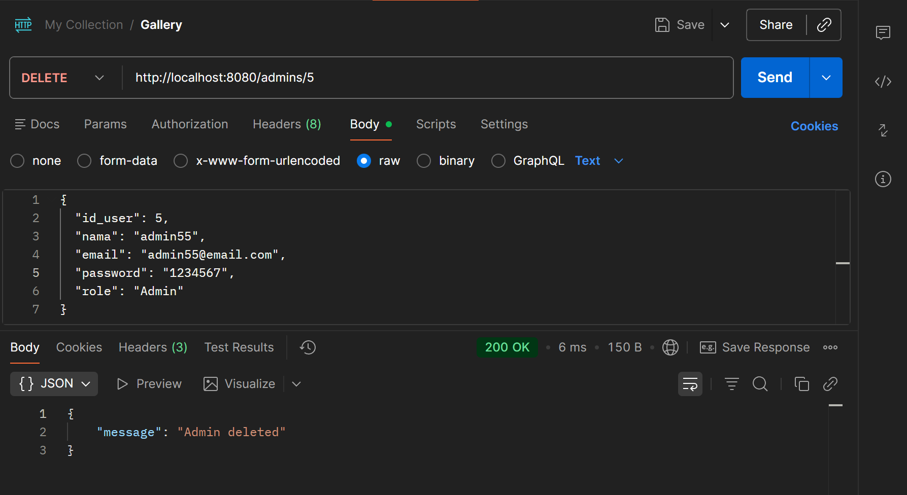

_CEK DELETE_
```
GET http://localhost:8080/admins/5
```
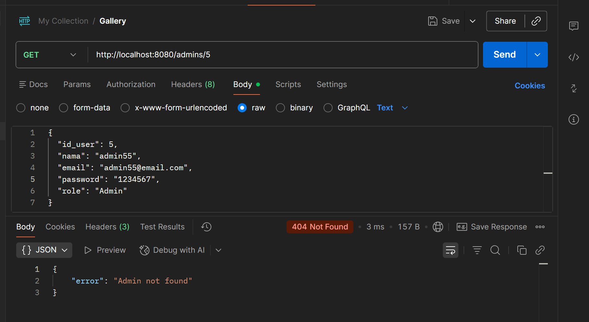
---

# Gallery Endpoints

## Get All Gallery
```
GET http://localhost:8080/gallery/
```
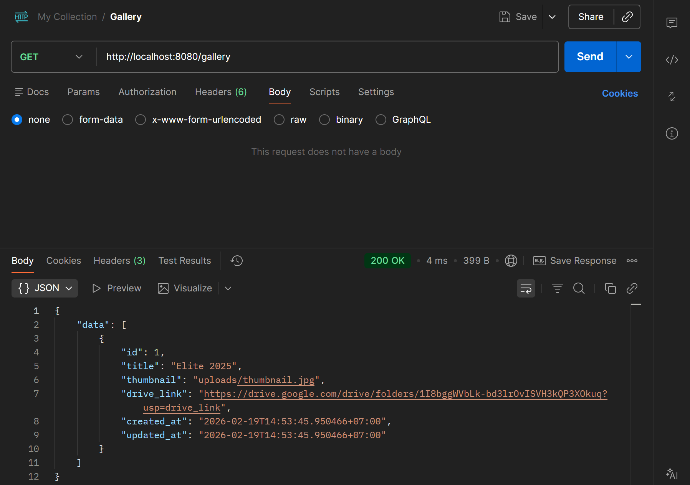

---

## Get Gallery by ID
```
GET /gallery/:id
```

---

## Create Gallery
_GO TO BODY AND USE "form-data", use the name and data type like the screenshoot below, value is up to you_
```
POST http://localhost:8080/gallery/
```
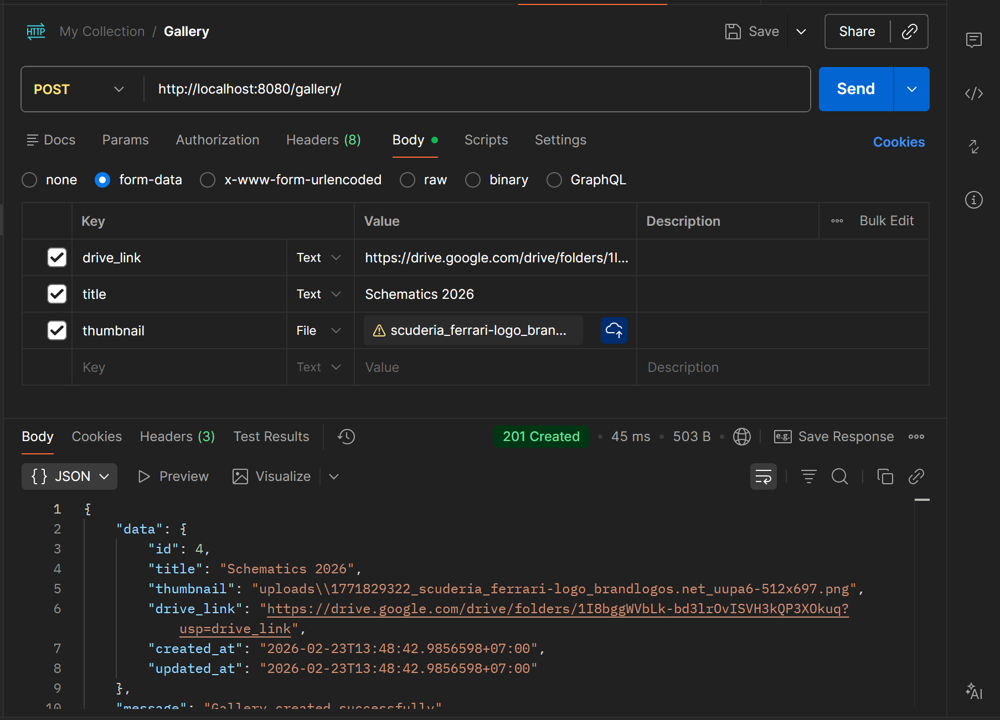

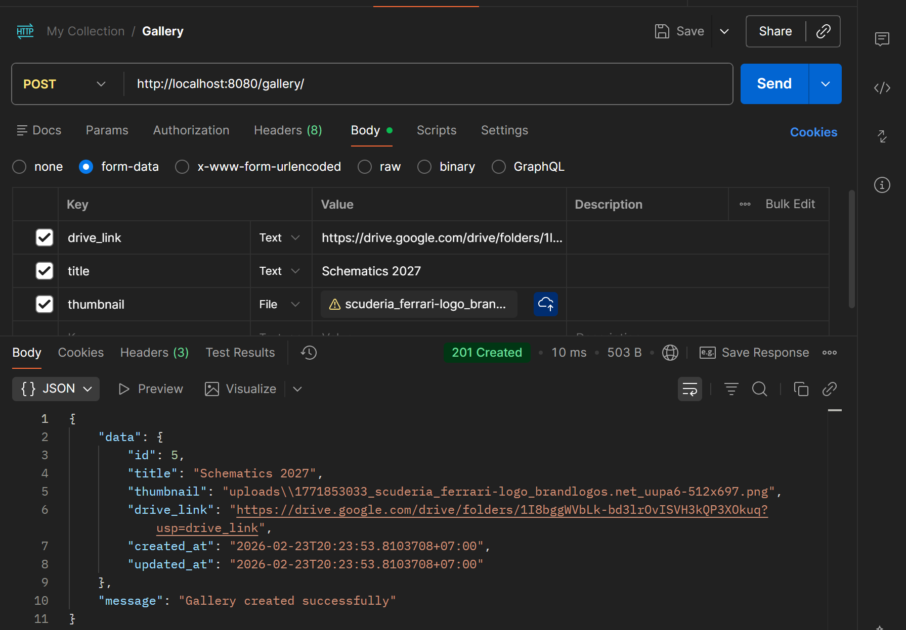

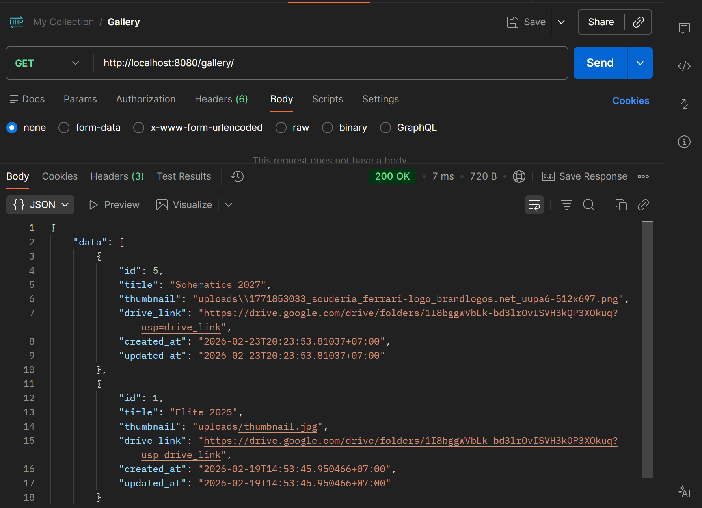

## Update Gallery
```
PUT http://localhost:8080/gallery/(id)
```

_EXAMPLE_
```
PUT http://localhost:8080/gallery/4
```
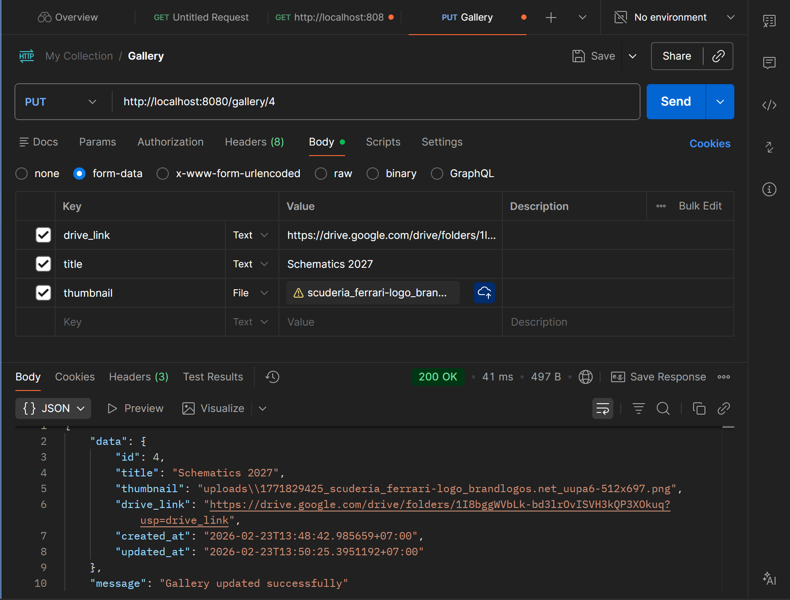
---

## Delete Gallery
```
DELETE http://localhost:8080/gallery/(id)
```

_EXAMPLE_
```
DELETE http://localhost:8080/gallery/4
```
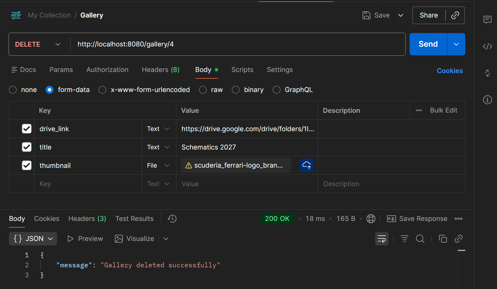
---

# Static File Access

Thumbnail dapat diakses melalui:

```
http://localhost:8080/uploads/<filename>
```

_EXAMPLE_
```
http://localhost:8080/uploads/thumbnail.jpg
```
---

# Error Response Example

```json
{
  "error": "data not found"
}
```

### Status Codes

| Code | Meaning |
|------|----------|
| 200  | Success |
| 201  | Created |
| 400  | Bad Request |
| 404  | Not Found |
| 500  | Internal Server Error |

---

# 🧪 API Testing

Testing dilakukan menggunakan Postman.

---

# How To Run

## Clone Repository

```
git clone https://github.com/Project-Flexoo-Academy/Repo-Back-End.git
```

## Install Dependencies

```
go mod tidy
```

## Setup Database

Buat database MySQL dan sesuaikan konfigurasi di file config.

## Run Application

```
go run main.go
```

Server berjalan di:

## Gallery
```
http://localhost:8080/gallery/
```

## Admin
```
http://localhost:8080/admins/
```
